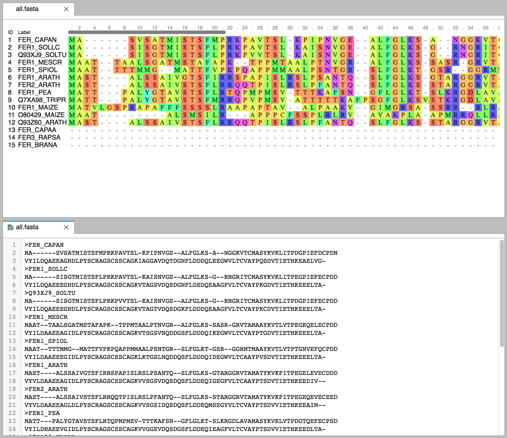

# This repo is deprecated. The Fasta viewer has been moved to https://github.com/jupyterlab/jupyter-renderers

# JupyterLab Fasta Viewer

A JupyterLab extension for viewing
[Fasta](https://en.wikipedia.org/wiki/FASTA_format) information. A file renderer
for files with `.fasta` extensions and a mime renderer for the
`application/vnd.fasta.fasta` mimetype is included. This extension uses the
[MSA Fasta viewer](http://msa.biojs.net/).



To use the file viewer, right-click on a `.fasta` file and choose the `Fasta` viewer.

To use the notebook viewer, you can define a Fasta display class like:

```python
from IPython.display import display
class Fasta:
    def __init__(self, data):
        self.data = data
    def _ipython_display_(self):
        bundle = {
            'application/vnd.fasta.fasta': self.data,
            'text/plain': self.data
        }
        display(bundle, raw=True)
```
and then display `Fasta('some fasta data')`
```python
Fasta(""">SEQUENCE_1
MTEITAAMVKELRESTGAGMMDCKNALSETNGDFDKAVQLLREKGLGKAAKKADRLAAEG
LVSVKVSDDFTIAAMRPSYLSYEDLDMTFVENEYKALVAELEKENEERRRLKDPNKPEHK
IPQFASRKQLSDAILKEAEEKIKEELKAQGKPEKIWDNIIPGKMNSFIADNSQLDSKLTL
MGQFYVMDDKKTVEQVIAEKEKEFGGKIKIVEFICFEVGEGLEKKTEDFAAEVAAQL
>SEQUENCE_2
SATVSEINSETDFVAKNDQFIALTKDTTAHIQSNSLQSVEELHSSTINGVKFEEYLKSQI
ATIGENLVVRRFATLKAGANGVVNGYIHTNGRVGVVIAAACDSAEVASKSRDLLRQICMH""")
```
## Prerequisites

* JupyterLab

## Installation

Clone this repo into a directory (say jupyterlab-fasta), and then do

```bash
jupyter labextension install ./jupyterlab-fasta
```

## Development

For a development install (requires npm version 4 or later), do the following in the repository directory:

```bash
npm install
jupyter labextension link .
```

To rebuild the package and the JupyterLab app:

```bash
npm run build
jupyter lab build
```
